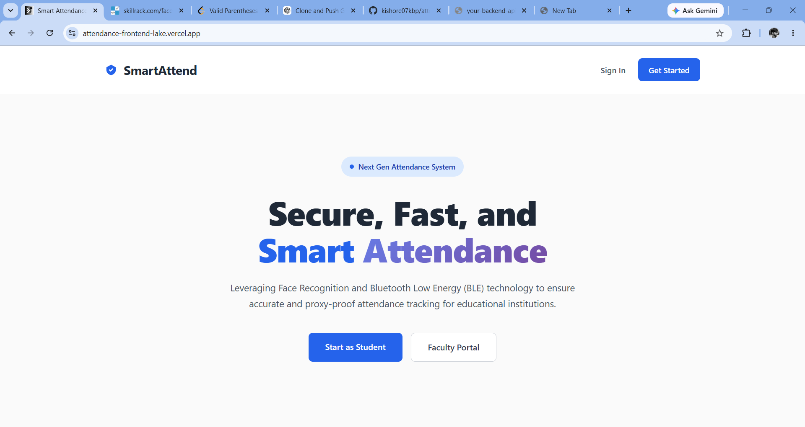
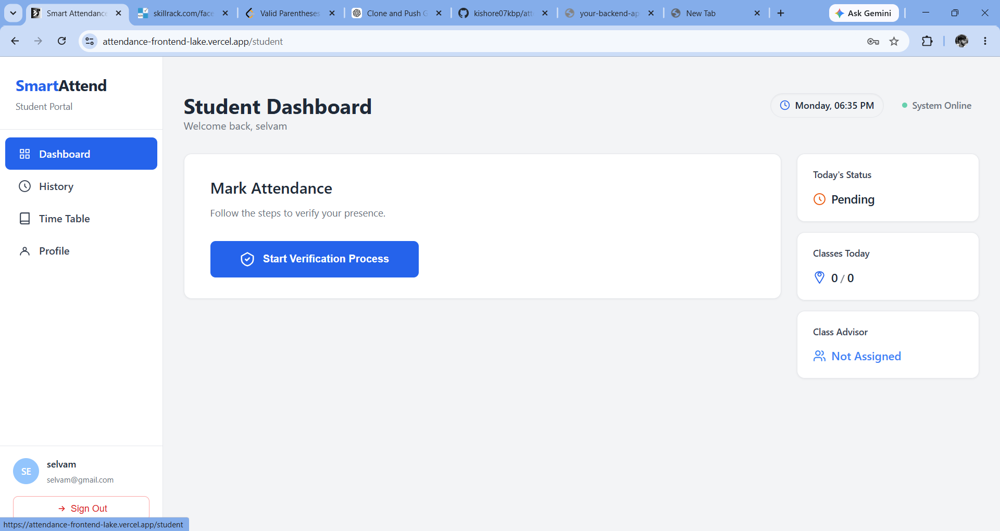
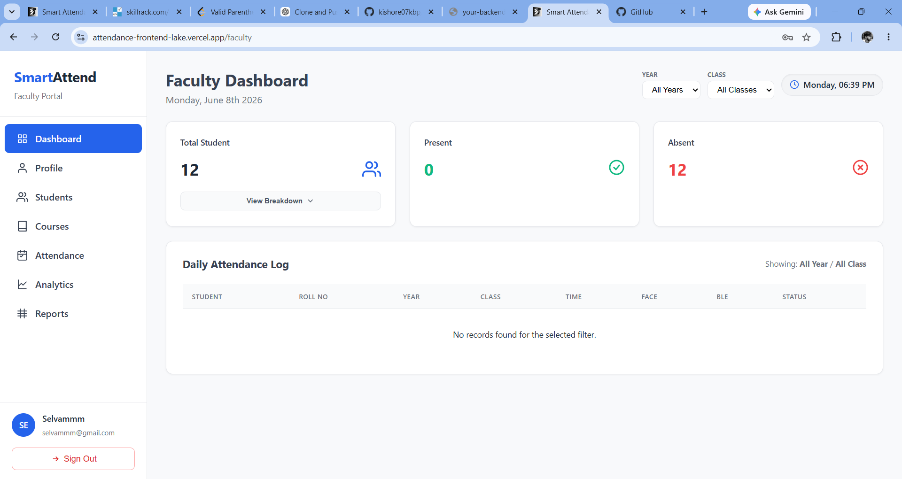
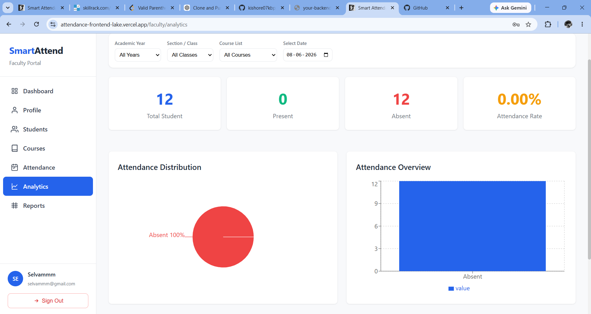
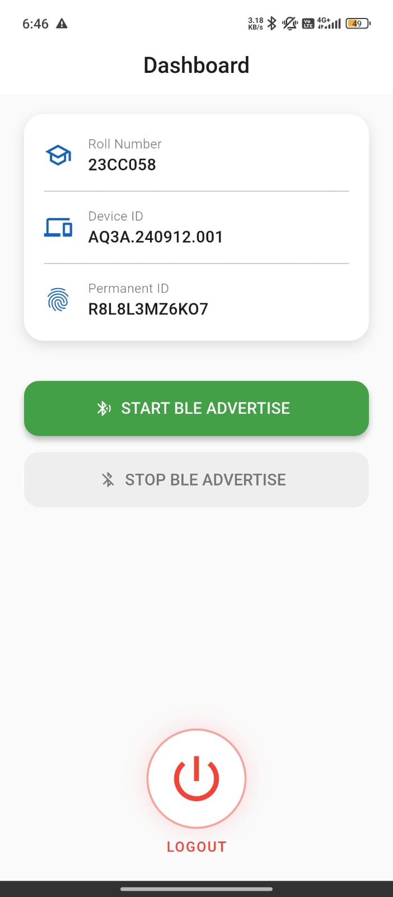

# 🎓 Smart Attendance System

> An IoT-enabled Smart Attendance Platform built using **MERN Stack, Flutter, ESP32, BLE, MQTT, and Face Recognition** to automate attendance tracking, prevent proxy attendance, and provide real-time monitoring for educational institutions.


---

# 🚀 Live Deployment

### 🌐 Frontend Application

https://attendance-frontend-lake.vercel.app/

### ⚙️ Backend API

```text
https://your-backend-api-url.com
```

---

# 📖 Project Overview

Traditional attendance systems are often affected by manual errors, proxy attendance, delayed record updates, and limited monitoring capabilities.

The Smart Attendance System addresses these challenges by integrating:

* Face Recognition
* Bluetooth Low Energy (BLE)
* ESP32 IoT Nodes
* MQTT Communication
* Flutter Mobile Application
* MERN Stack Dashboard

The system provides a secure, scalable, and automated attendance management solution for educational institutions.

---

# 🎯 Project Objectives

* Automate attendance collection and recording.
* Eliminate proxy attendance through multi-factor verification.
* Enable real-time attendance monitoring.
* Reduce faculty workload.
* Improve attendance accuracy and transparency.
* Build a scalable IoT-based attendance infrastructure.

---

# 🏗️ System Architecture

```text
┌─────────────────────────┐
│ Flutter Mobile App      │
│ BLE Advertisement       │
└────────────┬────────────┘
             │
             ▼
┌─────────────────────────┐
│ ESP32 BLE Scanner Nodes │
└────────────┬────────────┘
             │
             ▼
┌─────────────────────────┐
│ MQTT Communication      │
└────────────┬────────────┘
             │
             ▼
┌─────────────────────────┐
│ Node.js Backend API     │
└────────────┬────────────┘
             │
             ▼
┌─────────────────────────┐
│ MongoDB Atlas Database  │
└────────────┬────────────┘
             │
             ▼
┌─────────────────────────┐
│ React Faculty Dashboard │
└─────────────────────────┘
```

---

# 🔄 Attendance Workflow

1. Student logs into the Flutter application.
2. Mobile app broadcasts BLE packets containing a unique identifier.
3. ESP32 scanners detect BLE advertisements.
4. Device identity is validated through BLE verification.
5. Face recognition verifies the student's identity.
6. Attendance is recorded in MongoDB Atlas.
7. Faculty dashboard updates attendance records in real time.

---

# ✨ Key Features

## 🎯 Smart Attendance

* Face Recognition-based verification
* Automatic attendance marking
* Course-wise attendance tracking
* Real-time attendance monitoring

## 🔒 Anti-Proxy Attendance

* Device Binding
* Permanent BLE Identifier
* Face Verification
* BLE Presence Validation

## 📱 Mobile Application

* Flutter-based Student App
* Attendance History
* Attendance Statistics
* BLE Broadcasting

## 👨‍🏫 Faculty Dashboard

* Student Management
* Attendance Reports
* Course Management
* Attendance Analytics

## 📡 IoT Integration

* ESP32 BLE Scanner Nodes
* MQTT Communication
* Real-Time Device Detection
* Scalable IoT Infrastructure

---

# 🛠️ Technology Stack

| Category       | Technologies                  |
| -------------- | ----------------------------- |
| Frontend       | React.js, HTML5, CSS3         |
| Backend        | Node.js, Express.js           |
| Database       | MongoDB Atlas                 |
| Mobile App     | Flutter                       |
| Authentication | JWT                           |
| IoT Hardware   | ESP32                         |
| Communication  | BLE, MQTT                     |
| Tools          | Git, GitHub, Postman, VS Code |

---

# 🏗️ System Components

| Component            | Description                                                                                                                       |
| -------------------- | --------------------------------------------------------------------------------------------------------------------------------- |
| Frontend Application | React.js-based dashboard for faculty and administrators to manage attendance, courses, and students.                              |
| Backend API          | Node.js and Express.js REST API responsible for authentication, attendance processing, BLE verification, and database operations. |
| Mobile Application   | Flutter-based student application for BLE broadcasting and attendance tracking.                                                   |
| Database             | MongoDB Atlas cloud database storing students, courses, attendance records, and device information.                               |
| IoT Layer            | ESP32 scanner nodes that detect BLE devices and transmit data to the backend.                                                     |
| Communication Layer  | BLE and MQTT protocols enabling real-time attendance verification.                                                                |

---

# 📸 Screenshots

### Login Page



### Student Dashboard



### Faculty Dashboard



### Attendance Reports



### Flutter Mobile Application



# 🔐 Authentication

Protected routes require JWT authentication.

```http
Authorization: Bearer <token>
```

---

# 🚦 Core API Endpoints

## Authentication

```http
POST /api/auth/register
POST /api/auth/login
```

## Student

```http
GET  /api/students/profile
POST /api/students/register-face
POST /api/students/mark-attendance
GET  /api/students/attendance-history
```

## Faculty

```http
GET    /api/staff/students
POST   /api/staff/students
PUT    /api/staff/students/:id
DELETE /api/staff/students/:id
```

## Devices

```http
POST /api/devices/scan
GET  /api/devices/active-scans
```

---

# 🗄️ Database Models

## Student

```javascript
{
  permanentId,
  registrationNumber,
  studentClass,
  year,
  faceDescriptor
}
```

## Attendance

```javascript
{
  rollNumber,
  course,
  status,
  timestamp
}
```

---

# ⚙️ Environment Variables

```env
MONGODB_URI=

JWT_SECRET=

BREVO_API_KEY=

EMAIL_FROM=
```

---

# 🚀 Local Setup

## Backend

```bash
npm install
npm run dev
```

## Frontend

```bash
npm install
npm run dev
```

## Flutter Application

```bash
flutter pub get
flutter run
```

---

# 📈 Future Enhancements

* AI-based Attendance Analytics
* Geofencing Support
* Push Notifications
* QR Code Backup Attendance
* Advanced Reporting Dashboard
* Multi-Campus Deployment

---

# 🏆 Project Highlights

* Full-Stack MERN Development
* Flutter Mobile Development
* BLE Communication
* MQTT-Based IoT Integration
* Face Recognition Attendance Verification
* MongoDB Atlas Cloud Database
* Real-Time Attendance Tracking
* Scalable Educational Technology Solution

---

# 👨‍💻 Author

### S. Thamarai Selvan


---


